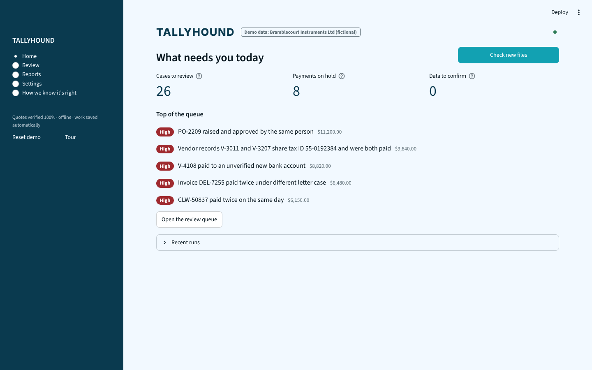
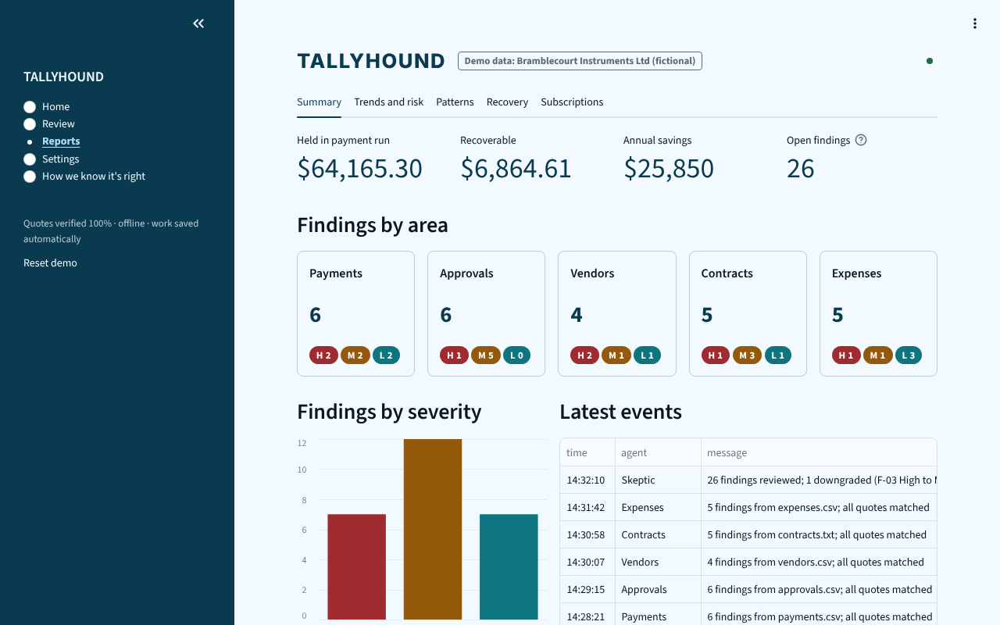
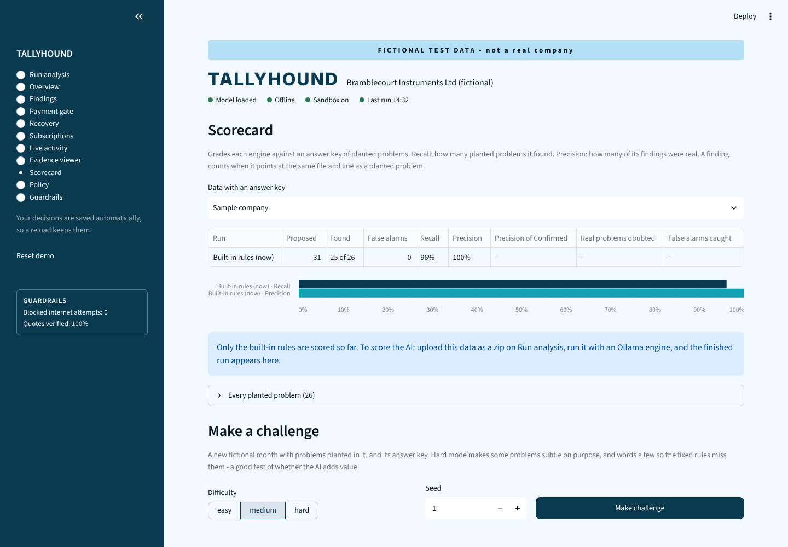
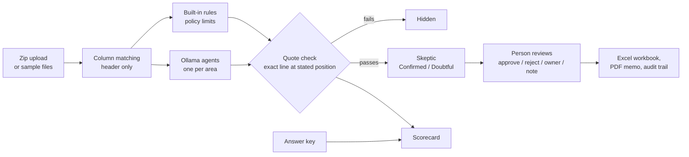
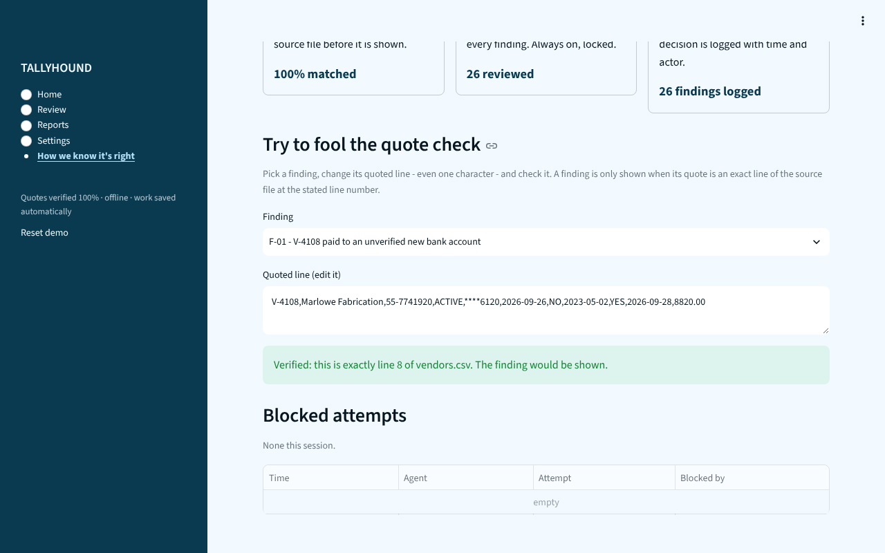

# Tallyhound

[](https://github.com/aleksarriola-max/Tallyhound/actions/workflows/ci.yml)

[](LICENSE)

A finance audit console built with Streamlit. Fixed rules and optional local AI agents **propose** findings about
accounts-payable data - the bills a company pays its suppliers - and a person approves or rejects every one. The demo
data is entirely fictional (Bramblecourt Instruments Ltd, its suppliers, staff and products).

**Live demo:** https://tallyhound-kfzkutbxmxdsrynlmppoll.streamlit.app/

> **Status: a working prototype, not accounting software.** Tallyhound helps a person look for problems; it does not
> replace an auditor, it does not move money, and its findings are suggestions to check. Use your own judgement and
> your organisation's controls. See [SECURITY.md](SECURITY.md) before putting real company data into it.



## Why it exists

Audit tools that act on their own are hard to trust. Tallyhound is built around one rule: **agents only propose, people
decide.** Every finding quotes the exact line of the file it comes from, a second agent (the *Skeptic*) tries to
disprove it, and nothing is approved, rejected, held or released without a person pressing a button. Every press is
recorded in a tamper-evident audit trail.

| Review: one queue of cases | Payment run |
|---|---|
|  |  |

| Reports | Scorecard |
|---|---|
|  |  |

## Quick start

You need [Python](https://www.python.org/downloads/) 3.10 or newer.

```bash
git clone https://github.com/aleksarriola-max/Tallyhound.git
cd Tallyhound
python -m venv .venv
source .venv/bin/activate          # Windows: .venv\Scripts\activate
pip install -r requirements.txt
streamlit run app.py
```

Your browser opens at http://localhost:8501. The checklist on Home walks you through a run, a failed agent and a
retry, reviewing a case, and downloading the results (about five minutes). Best viewed at least 1280px wide.

To try your own files, press **Check new files** on Home and upload a zip (see [Your own files](#your-own-files)).
To try the AI engines, install [Ollama](https://ollama.com), run `ollama serve` and `ollama pull qwen3.5:9b`, then pick
an Ollama engine under *Engine and agents* in the same dialog.

## Words used here

| Term | Meaning |
|---|---|
| AP (accounts payable) | The money a company owes its suppliers, and the team that pays them. |
| PO (purchase order) | The approved order raised before buying. Many policies need one above a set amount. |
| W-9 / tax form | The supplier's tax details on file (US form name; any tax registration works the same way). |
| Finding | A possible breach of a policy clause, with the file line that shows it. |
| Case | Findings that point at the same line, decided together. |
| Skeptic | A second agent that tries to disprove each finding: *Confirmed* or *Doubtful*. With the built-in rules alone it simply confirms. |
| Approve / Reject | Approve = this is a real problem to follow up. Reject = it is not (a reason is required). Neither pays anything. |
| Payment gate | Eight checks on a proposed payment run; each line is put on HOLD or allowed to RELEASE. |
| Trap | A legitimate thing that looks suspicious (a batch transfer, rent without a PO). Raising it is a false alarm. |
| Recall / precision | Share of planted problems found / share of findings that were real. |
| Materiality | The amount under which a finding counts as a minor item. |
| Segregation of duties | The person who ran an analysis may not approve its findings. |

The sample data mixes UK and US conventions (Ltd, W-9, "instalment") on purpose: real books do too.

## How good is it?

The **Scorecard** (under *How we know it's right*) grades every engine against an answer key of planted problems:
recall, precision, and for AI runs whether the Skeptic helped - how many false alarms it caught and how many real
problems it wrongly doubted. On the sample company the built-in rules find 25 of 26 planted problems with no false
alarms; the one they miss needs staff records they do not have.

**Make a challenge** (on the Scorecard, or `python scripts/make_challenge.py --difficulty hard --seed 4`, which writes
`challenge-hard-4.zip` with an `answer_key.csv` inside) creates a new fictional month with problems and traps planted
in it. Hard mode makes some problems subtle and rewords three of them (a personal claim, a tax ID without its dash, a
surcharge under another name). The rules have since learned to catch two of those and still miss the reworded
surcharge, so hard mode is where an AI engine has to show it adds something.

## Architecture



Agents and rules only ever **propose**. Every quote is checked against the uploaded file before anyone sees it (try
to break it under *How we know it's right > Guardrails*), and nothing is approved, rejected, held or released without
a person. [CONTRIBUTING.md](CONTRIBUTING.md) follows one finding through the code.



## Guardrails against false alarms

A tool that flags everything is as useless as one that flags nothing. Tallyhound is tested against *traps*: things that
look suspicious but are normal in real books. Every challenge month plants 22 of them next to the real problems: a
batch bank transfer paying three invoices, bank fees, payroll, tax and card settlements on the statement, rent and
utilities paid without a PO, a 2% early-payment discount, a 40-cent rounding difference, an invoice paid in two
instalments, a voided and re-issued payment, a day-first expenses export, a supplier spelt differently on the payment
run, a team dinner with the head count in the notes, a CPA society membership, a weekend taxi on a business trip, a
remit-to vendor record, a vendor closed after its last payment, and an invoice PDF that shows the net total before tax.

Before these were fixed the built-in rules raised about 30 false alarms per month (precision 37-47%). Now: 0 traps
flagged in 1,320 across 60 months, 100% precision, recall 100% easy / 100% medium / 96% hard.

What keeps it that way:

- **Quality gates in CI** (`tests/test_quality.py`): the build fails if any trap is flagged, precision drops below
  95%, recall drops below the bar per difficulty, or false alarms exceed 0.5 per 100 rows.
- **Regression cases**: in Review, open a rejected case's details and press *Save as test case*. Anonymise the
  downloaded file with `python scripts/anonymise.py case_F-03_1.2.json --out tests/cases/` (your file name will
  differ) and it becomes a permanent check: that false alarm can never come back.
- **Rule health**: each rule's reject rate from real reviewer decisions is shown under *Settings > Rules*. A rule
  rejected 60% or more of the time (after 5 decisions) is demoted to *Minor items* automatically - never deleted - and
  can be restored.
- **Shadow mode**: put a new or changed rule in shadow under *Settings > Rules*; it runs without touching the review
  queue until reviewers have marked enough of its findings as real.
- **Data check before a run**: after upload, Tallyhound shows what it believes about each file - date order, decimal
  commas, currencies, reversals, non-supplier bank lines, unreadable or three-decimal amounts, missing companion
  files - and asks when dates are ambiguous.
- **A queue worth reading**: findings that share a line are one case, decided once; cases are ranked by severity,
  money and the Skeptic's confidence (top 20 first); items under the materiality threshold are grouped as *Minor
  items*; each finding says what would clear it.
- **Tolerances and exemptions** under *Settings > Policy*: amount tolerance, minor-item threshold, and the bills that
  need no PO.

## Safe with untrusted files

Uploads come from outside, so they are treated as hostile (`tests/test_audit*.py` upload months full of them and walk
every page):

- **No HTML or links from files**: names, notes and model text are escaped before display, so a supplier called
  `` or `[click](http://...)` shows as plain text. Spreadsheet cells that start with `=` stay text, not
  formulas, in the workbook and in the folder-check CSV, and the PDF memo handles `&` and `<`.
- **Limits**: 50 MB per zip and per file, 100 MB once unpacked (stops zip bombs; 20 MB on a public copy, which also
  runs one analysis at a time), 300,000 lines, lines cut at 4,000 characters, 300 PDFs per zip. Invoice PDFs are read by a separate worker process with a time and memory limit, so a
  hostile PDF cannot freeze the app. Password-protected or corrupt entries become a note, not a crash. Two files for
  the same slot are reported, never merged.
- **Encodings**: UTF-8, UTF-16 and Windows-1252 (Excel's "Save as CSV") keep their accents.
- **Unreadable values are reported**: an amount like `nan` or a date like `31/31/2026` is listed in the data check
  instead of silently counting as zero.
- **Model address**: only http(s), never link-local addresses such as the cloud metadata service, no redirects, replies
  capped at 20 MB. On a public copy (Streamlit Community Cloud is detected automatically, or set `TALLYHOUND_PUBLIC=1`)
  only `localhost` is accepted, so the demo can't be used to reach the network it runs on; set `TALLYHOUND_PUBLIC=0` on
  your own server.
- **Sessions and sign-in**: without sign-in (the demo), saved work is keyed by a random 128-bit id in the page address -
  anyone with that address sees that work. With sign-in on, everyone signed in shares one team workspace on the server
  and the address is ignored, so nobody can plant a link that captures someone else's work; signing out clears the
  browser tab. When two people save at the same moment, the second person's decisions are re-applied on top of the
  first person's (a decision already made on the same finding wins), and every tab is told when a teammate saved. Five wrong passwords lock a name for a minute; a users file that cannot be read keeps sign-in on and
  lets nobody in; only an admin can reset (it erases the audit trail). Password hashes, the trail key and the saved
  work are readable only by the server's user.

[SECURITY.md](SECURITY.md) has the threat model, hardening steps and how to report a vulnerability.

## Benchmark

`python scripts/benchmark.py` runs the engines on fresh challenge months (20 per difficulty by default) and writes
`benchmark-results/benchmark.md` and `.csv`; add `--out docs` to update the published [docs/benchmark.md](docs/benchmark.md).
Built-in rules, 20 months per difficulty with traps: easy 100%, medium 100%, hard 96% of planted problems found, 0 of
1,320 traps flagged. The generator plants problems shaped like the rules' checks, so treat this as a regression
baseline that the AI engines must beat. The AI engines are benchmarked on your own machine, with Ollama running:

```bash
python scripts/benchmark.py --engines rules,rules+skeptic,ollama,ollama-tools --models qwen3.5:9b --seeds 1-3
```

Runs that fail (for example because the model server is not running) are reported and left out of the results.

## Your own files

Press *Check new files* on Home and upload a zip containing any of:

| File | Needed columns |
|---|---|
| `payments.csv` | payment_id, pay_date, invoice_date, supplier, invoice_no, invoice_amount, paid_amount (vendor_id helps) |
| `approvals.csv` | record_id, doc_no, date, vendor, amount, requested_by, approved_by, approver_role, po_no |
| `vendors.csv` | vendor_id, name, tax_id, status, bank_changed_on, bank_verified, w9_on_file, last_paid_on, last_paid_amount |
| `expenses.csv` | claim_id, date, employee, category, amount, receipt_ref, notes, people |
| `bank_statement.csv` | date, description, amount (reference optional) |
| `payment_run.csv` | line, supplier, invoice, amount (vendor_id and bank_last4 if you have them) |
| `contracts.txt` | see `data/source/contracts.txt` |
| invoice PDFs | any names; PDFs with a text layer |

Files with other column names can be matched once (*Settings > Data*); only the header is renamed, so quotes are still
exact lines of your file. To try it quickly, zip the `data/source/` folder. Pick the upload under *Data to check* and
press **Run**. Findings, review, the payment run and downloads then work on your files; supplier recovery and
subscriptions are sample-only. The zip is read in memory and never written to disk as a file; each dataset keeps its
own decisions.

## Deploying

### On a server (Docker)

```bash
docker compose up --build                              # app on http://localhost:8501, plus Ollama
docker compose exec ollama ollama pull qwen3.5:9b      # once
```

Saved work, users and the audit-trail key live in the `tallyhound-data` volume; `docker compose down -v` deletes them,
and every saved trail then shows as broken. For a real deployment set `TALLYHOUND_TRAIL_KEY` (a long random secret, in
a `.env` file next to `docker-compose.yml`) and keep a copy somewhere safe. Add users inside the container with
`docker compose exec tallyhound python scripts/add_user.py <name> <role>`. The app is bound to 127.0.0.1; put a proper
reverse proxy with HTTPS in front before opening it to a network.

### Sign-in and segregation of duties

Off by default (so the public demo stays open). Create users to turn it on; each command asks for the password:

```bash
python scripts/add_user.py alice reviewer
python scripts/add_user.py bob preparer
```

Roles: *preparer* uploads and runs, *reviewer* approves, rejects and clears holds, *admin* does both and changes the
policy. Whoever started a run cannot approve its findings. Passwords are stored only as salted PBKDF2 hashes in
`.tallyhound_state/users.json`.

### Weekly folder check with alerts

```bash
python scripts/watch.py "C:/Finance/AP inbox" --alert
```

Runs the built-in checks and the payment gate on a folder (or the newest zip in it), writes
`<folder>/tallyhound-reports/report_<date>_<time>.md` and a CSV, and alerts via Slack (`TALLYHOUND_SLACK_WEBHOOK`) or
email (`TALLYHOUND_SMTP_HOST` and `TALLYHOUND_MAIL_TO`, plus optional `TALLYHOUND_SMTP_PORT`, `_USER`, `_PASSWORD` and
`TALLYHOUND_MAIL_FROM`) when there are new findings, held payments or files it could not check. One channel failing
does not stop the other, and a failed alert is sent again next run. Exit codes for the scheduler: 0 everything
checked, 1 an alert could not be sent, 2 the folder does not exist, 3 some data was not checked (listed under "Data
that was NOT checked" in the report). Schedule it with Windows Task Scheduler or cron.

### Other model servers

Ollama is the default. For LM Studio, vLLM or llama.cpp, upload your files, then set the model server address under
*Engine and agents* in the Check new files dialog to their OpenAI-compatible address ending in `/v1` (for example
`http://localhost:1234/v1`).

## How it works

- **Five sections** - *Home* says what needs you today and has one button, *Check new files*. *Review* is one queue of
  cases (open Details for the evidence with its column names, the policy clause, the Skeptic, owner and notes), plus
  the payment run and the downloads. *Reports* has the summary, trends and vendor risk, recovery and subscriptions.
  *Settings* has policy, rules, data and users. *How we know it's right* holds the Scorecard, the guardrails and the
  audit trail.
- **Quote check** - a finding is shown only if its evidence appears word for word, at the stated line, in its source
  file. Anything else is hidden.
- **Skeptic review** - a second agent tries to disprove every finding. For the sample company the verdicts are
  pre-written; with an Ollama engine they come from the model.
- **Skeptic self-check** - if the Skeptic's verdict contradicts its own reason, it is asked once more; if it still
  disagrees with itself the finding is marked Unclear for a person to judge.
- **Payment gate** - eight checks per payment line decide HOLD or RELEASE, against the vendor master, approvals and past
  payments. Checks that need a file you did not upload are listed as not checked. Clearing a hold needs a reason.
- **Invoice PDFs** - read into `invoices.txt` and checked: no approval record, total different from the approved
  amount, the same invoice twice, and bank details that differ from the vendor master. Scanned PDFs without text are
  listed as skipped (they need OCR first).
- **Bank reconciliation** - money that left the bank with no recorded payment is High; recorded payments missing from
  the statement are Low. Fees, payroll, tax and card settlements are left out; batch transfers are matched to the
  payments they cover.
- **Column matching** - suggestions are pre-filled from common export column names (QuickBooks, Xero, NetSuite, bank
  downloads), and a matching you save is reused for files with the same header. Dates in several formats and amounts
  like `$1,234.50`, `1.234,50`, `(12.00)`, `120.00-` or `250.00 CR` are understood.
- **Learning from reviewers** - when rejecting, tick "Don't flag clause ... again for ..." to set that pattern aside on
  later runs (listed, and removable, under *Settings > Rules*). Repeated rejections just over a limit produce a
  suggested new limit.
- **Tamper-evident audit trail** - every entry is chained to the one before by a SHA-256 fingerprint, and the whole
  trail is sealed with a key only the server holds (`TALLYHOUND_TRAIL_KEY`, or a random key in
  `.tallyhound_state/trail.key`), so an edited, removed, added or cut-off entry shows, and so does a decision that
  disagrees with the trail. A re-run is one more entry, never a fresh trail.
- **Exports** - *Review > Download* builds an Excel workbook (with an audit trail sheet) and a PDF memo; both say
  "partly reviewed" while findings are still pending. The draft is the findings alone, before anyone decides.
- **Saved work** - decisions, reasons, cleared holds, the audit trail and a run in progress are saved in a small SQLite
  database, so a reload keeps them. Saved work is deleted after 14 days without use (the team workspace is kept). On
  Windows it lives in `%LOCALAPPDATA%\Tallyhound` (not in a OneDrive-synced folder); set `TALLYHOUND_STATE_DIR` to
  choose another place.
- **Four engines for uploads** (*Engine and agents* in the Check new files dialog): *Built-in rules* are fixed tests of
  the policy, fast and repeatable, no AI. *Rules + Ollama Skeptic* finds candidates with the rules and lets the model
  challenge them. *Ollama agents* send each file to a model on your computer, then a Skeptic pass challenges every
  finding. *Ollama agents with tools* query the files (filter rows, find duplicates, read given lines) instead of
  reading them whole, so they scale to big files. The model never supplies evidence: a finding is kept only if its
  quote is an exact copy of the line at the stated position.
- **Simulated run** - for the sample company the agent run is a timer, about 20 seconds per queue item. The Expenses
  agent fails once on purpose so you can try Retry.

## Project layout

```
app.py                 page setup, sidebar navigation, run ticker
tallyhound/
  layout.py            the five sections: Home, Review, Reports, Settings, How we know it's right
  run_analysis.py      upload, data check, column matching, engine settings, run progress
  review.py            decisions, downloads, test-case export
  pages.py             Reports summary, Payment run, Recovery, Subscriptions, Audit trail, Guardrails
  pages_extra.py       Scorecard, Settings > Policy and Rules, Trends and vendor risk
  rules.py             the built-in rule checks (start here to add a rule)
  gate.py              payment gate checks for uploaded runs
  invoices.py          invoice PDF reading and checks;  pdfworker.py  the sandboxed PDF reader process
  agents.py            Ollama agents and the Skeptic;  agents_tools.py  tool-using agents;  llm.py  model client
  custom.py            uploads, the run for uploaded files, per-dataset decisions, the data check
  common.py            data loading, quote check, audit trail, styling, session state
  triage.py            cases, priority, minor items, rule health, shadow mode
  score.py             the Scorecard maths;  challenge.py  challenge generator with answer keys
  exports.py           Excel and PDF builders;  headless.py  folder check and alerts without the app
  store.py             saved work (SQLite);  auth.py  sign-in, roles, segregation of duties
  columns.py           column-matching suggestions;  learn.py  suppressions and limit hints
  sim.py               simulated demo run;  guide.py  the guided tour checklist
data/*.csv             the sample company's data (regenerate with scripts/make_data.py)
data/source/           the fictional source files that findings quote
scripts/               make_data, make_challenge, benchmark, watch, add_user, anonymise
tests/                 automated tests (test_quality.py: the false-alarm gates; cases/: regression cases)
Dockerfile, docker-compose.yml
```

## Tests and contributing

```bash
pip install -r requirements-dev.txt
ruff check .
pytest
```

The tests check that the data keeps its promises, that every page renders, that the review and export flow works,
that hostile files are handled, and that the rules raise no false alarms on the traps. CI runs them on Python 3.12 and,
with the oldest supported Streamlit, on Python 3.10. See [CONTRIBUTING.md](CONTRIBUTING.md) - including how to add a
rule - and the [Code of Conduct](CODE_OF_CONDUCT.md). Changes are listed in [CHANGELOG.md](CHANGELOG.md).

## Notes

- License: [MIT](LICENSE). A project page is in `docs/index.html` and a write-up in `docs/WRITEUP.md`.
- The hosted demo is public: anyone with the link can use it and download the files. Everything in it is fictional;
  any resemblance of a supplier, person or product name to a real one is coincidence.
- Saved work lives in `.tallyhound_state/` on the server (set `TALLYHOUND_STATE_DIR` to move it). On Streamlit
  Community Cloud the disk is cleared when the app restarts, so saved work is kept for reloads but not forever.
