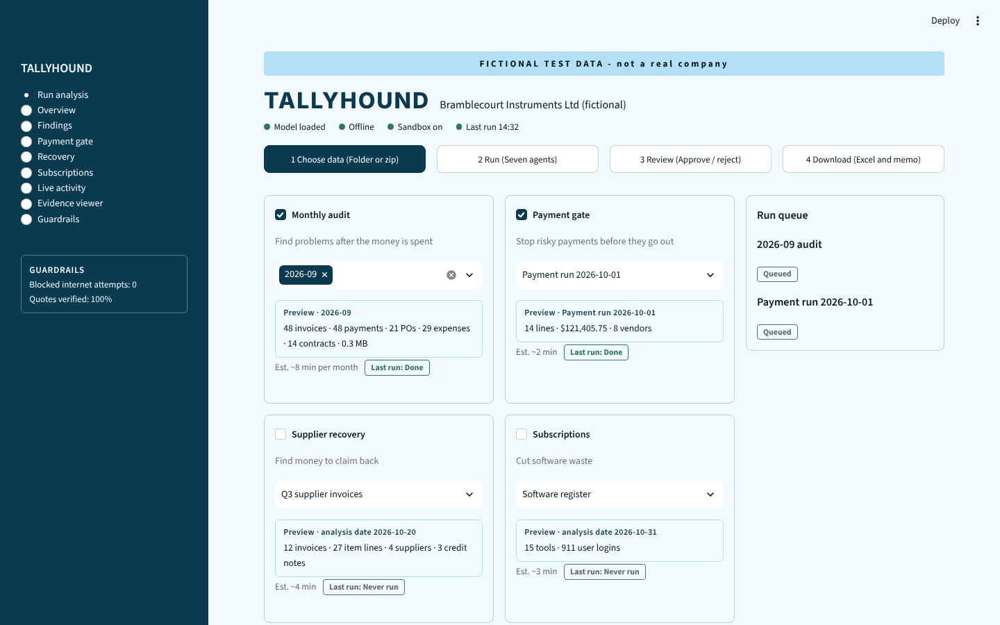
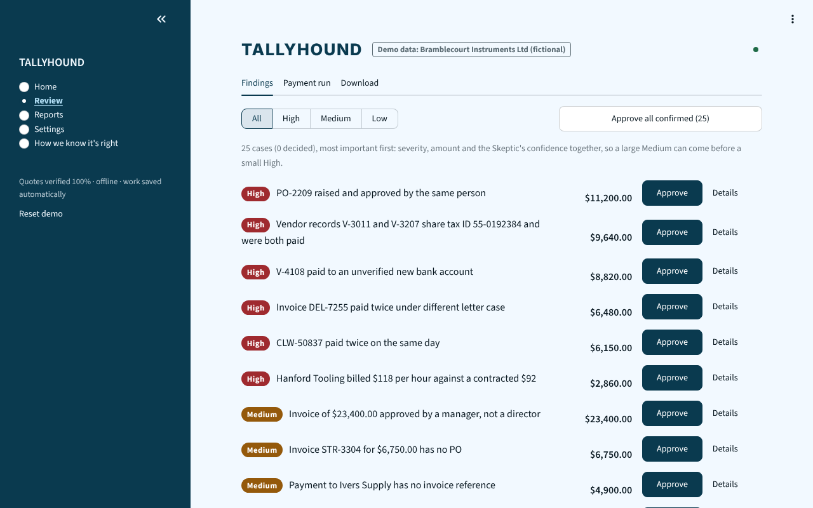
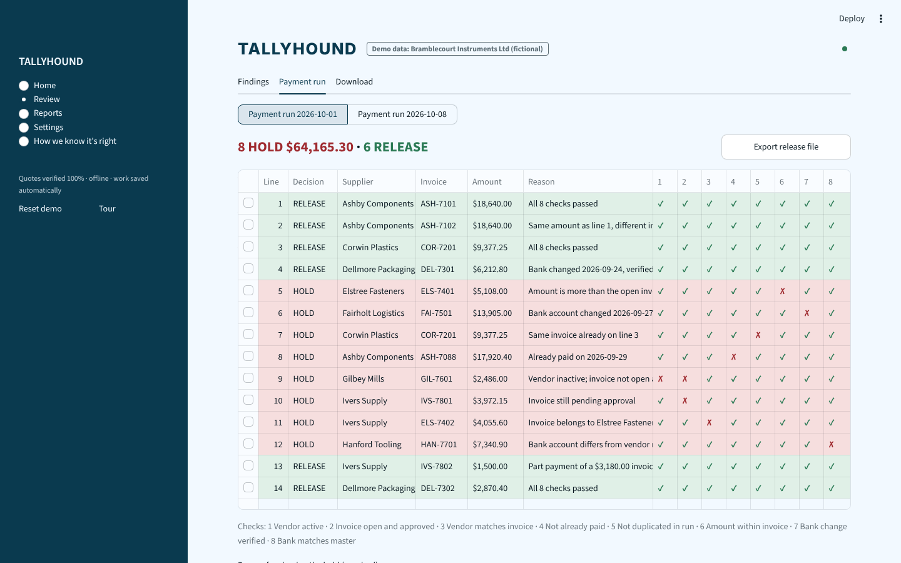
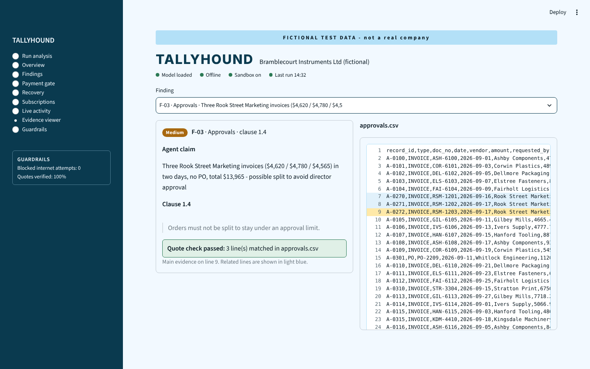
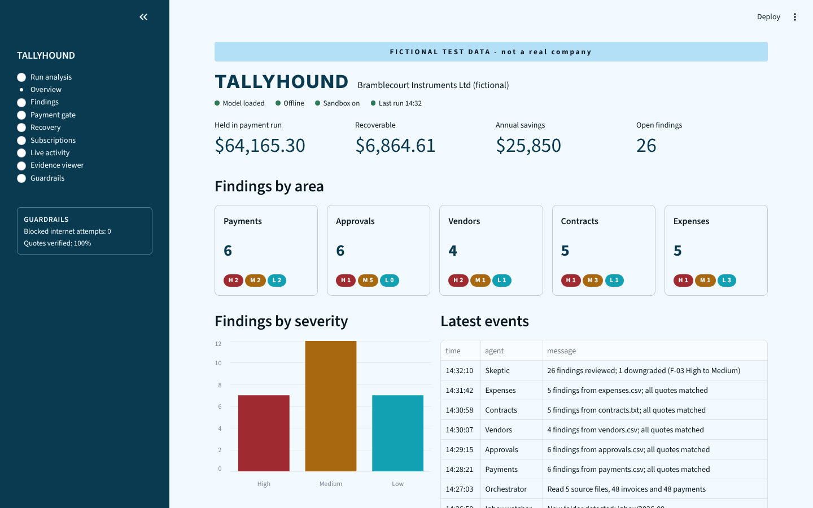

# Tallyhound

A finance audit console built with Streamlit. AI agents **propose** findings about accounts-payable data; a person approves or rejects every one. All data is fictional (Bramblecourt Instruments Ltd).

**Live demo:** https://tallyhound-kfzkutbxmxdsrynlmppoll.streamlit.app/



## Why it exists

Audit tools that act on their own are hard to trust. Tallyhound is built around one rule: **agents only propose, people decide.** Every finding carries evidence you can check, and nothing is approved, rejected, held or released without a person clicking a button.

| Review findings | Payment gate |
|---|---|
|  |  |

| Evidence viewer | Overview |
|---|---|
|  |  |

## Run it

```bash
pip install -r requirements.txt
streamlit run app.py
```

Needs Python 3.10+ and Streamlit 1.40 or newer. Best viewed in a window at least 1280px wide, though it also works on narrower screens.

## How it works

- **Run analysis** - a four-step flow: choose data, run the agents, review, download.
- **Quote check** - a finding is shown only if its evidence appears word for word, at the stated line, in its source file under `data/source/`. Anything else is hidden.
- **Skeptic review** - a second agent tries to disprove every finding. In this demo the verdicts are pre-written.
- **Payment gate** - eight checks per payment line decide HOLD or RELEASE. Clearing a hold needs a typed reason.
- **Exports** - Step 4 builds an Excel workbook (with an audit trail sheet) and a PDF memo from your decisions.
- **Guided tour** - a checklist at the top of Run analysis walks a first-time visitor through the whole flow: start a run, watch an agent fail, retry, review, download. Hide it any time.
- **Saved work** - decisions, reasons, cleared holds and the audit trail are saved to a small file keyed by a random id in the page address (`?s=...`), so a reload keeps them. Keep the address to come back to your work; "Reset demo" wipes it. Saved files are deleted after 14 days.
- **Your own files** - open "Add new data" on step 1 and upload a zip containing any of `payments.csv`, `approvals.csv`, `vendors.csv`, `contracts.txt`, `expenses.csv` (same columns as `data/source/`; to try it, zip that folder). Pick the new entry in the Monthly audit picker and run it. Findings, review and downloads then work on your files. Payment runs, supplier recovery and subscriptions still use the sample data. The zip is read in memory and never written to disk, and each dataset keeps its own decisions.
- **Two engines for uploads** (Advanced on step 1): *Built-in rules* are fixed tests of the policy, fast and repeatable, no AI. *Ollama agents* send each file to a model running on your computer (default `qwen3.5:9b`), then a Skeptic pass challenges every finding. The model never supplies evidence: a finding is kept only if its quote is an exact copy of the line at the stated position, so an invented quote is dropped. Ollama is only reachable when you run the app on the same computer (`ollama serve`); the hosted demo uses the built-in rules.
- **Simulated run** - for the sample company the agent run is a timer, about 20 seconds per queue item. The Expenses agent fails once on purpose so you can try Retry.

## Project layout

```
app.py                 page setup, sidebar navigation, run ticker
tallyhound/
  run_analysis.py      the four-step flow (Choose, Run)
  review.py            Review and Download steps
  pages.py             Overview, Findings, Payment gate, Recovery, Subscriptions,
                       Live activity, Evidence viewer, Guardrails
  sim.py               simulated agent run
  exports.py           Excel and PDF builders
  common.py            data loading, quote check, styling, session state
  custom.py            uploads, the run for uploaded files, per-dataset decisions
  rules.py             the built-in rule checks
  agents.py            Ollama agents and the Skeptic
  llm.py               small Ollama client
  store.py             saves and restores decisions across reloads
  guide.py             the guided tour checklist
data/*.csv             all sample data (nothing is hard-coded in the app)
data/source/           the fake source files that findings quote
scripts/make_data.py   regenerates all data
tests/                 automated tests
```

## Tests

```bash
pip install -r requirements-dev.txt
pytest
```

The tests check that the data keeps its promises (26 findings, every quote verifiable, payment gate and recovery totals), that every page renders, and that the review and export flow works. A GitHub Action runs them on every push.

## Notes

- The hosted demo is public, so anyone with the link can use it and download the files. Everything in it is fictional.
- Saved work lives in `.tallyhound_state/` on the server (set `TALLYHOUND_STATE_DIR` to move it). On Streamlit Community Cloud the disk is cleared when the app restarts, so saved work is kept for reloads but not forever.
