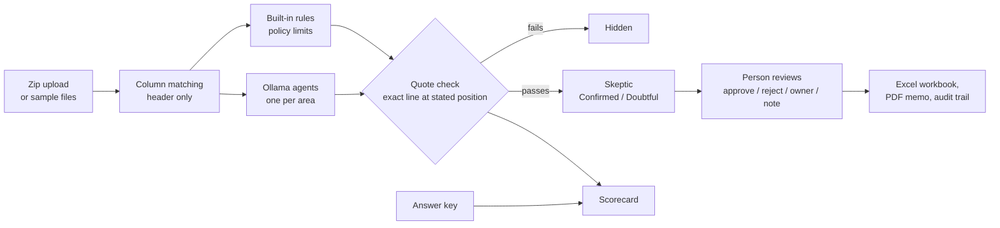

# Tallyhound

A finance audit console built with Streamlit. AI agents **propose** findings about accounts-payable data; a person approves or rejects every one. All data is fictional (Bramblecourt Instruments Ltd).

**Live demo:** https://tallyhound-kfzkutbxmxdsrynlmppoll.streamlit.app/


## Why it exists

Audit tools that act on their own are hard to trust. Tallyhound is built around one rule: **agents only propose, people decide.** Every finding carries evidence you can check, and nothing is approved, rejected, held or released without a person clicking a button.

| Review findings | Payment gate |
|---|---|
|  |  |

| Evidence viewer | Overview |
|---|---|
|  |  |

## How good is it?

The **Scorecard** page grades every engine against an answer key of planted problems: recall (how many it found), precision (how many of its findings were real), and for AI runs whether the Skeptic helped - how many false alarms it caught and how many real problems it wrongly doubted. On the sample company the built-in rules find 25 of 26 planted problems with no false alarms; the one they miss needs staff records they do not have.

**Make a challenge** (on the same page, or `python scripts/make_challenge.py --difficulty hard --seed 4`) writes a new fictional month with problems planted in it and an `answer_key.csv`. Hard mode makes some problems subtle and words three of them so the fixed rules miss them, which is the honest test of whether the AI adds anything.


## Architecture



Agents and rules only ever **propose**. Every quote is checked against the uploaded file before anyone sees it (try to break it on the Guardrails page), and nothing is approved, rejected, held or released without a person.


## Benchmark

`python scripts/benchmark.py` runs the engines on fresh challenge months and writes [docs/benchmark.md](docs/benchmark.md). Built-in rules, 20 months per difficulty: easy 100%, medium 100%, hard 89% of planted problems found, with no false alarms. That is strong but expected: the generator plants problems shaped like the rules' checks, and hard mode hides three on purpose. The AI engines are benchmarked on your own machine:

```bash
python scripts/benchmark.py --engines rules,rules+skeptic,ollama,ollama-tools --models qwen3.5:9b --seeds 1-3
```

## Run it

```bash
pip install -r requirements.txt
streamlit run app.py
```

Needs Python 3.10+ and Streamlit 1.40 or newer (`pip install -e .` also works). Best viewed in a window at least 1280px wide, though it also works on narrower screens.

### On a server (Docker)

```bash
docker compose up --build                              # app on http://localhost:8501, plus Ollama
docker compose exec ollama ollama pull qwen3.5:9b      # once
```

Saved work lives in a Docker volume. The app is bound to 127.0.0.1; put a proper reverse proxy with HTTPS in front before opening it to a network.

### Sign-in and segregation of duties

Off by default (so the public demo stays open). Create users to turn it on:

```bash
python scripts/add_user.py alice reviewer
python scripts/add_user.py bob preparer
```

Roles: *preparer* uploads and runs, *reviewer* approves, rejects and clears holds, *admin* does both and changes the policy. Whoever started a run cannot approve its findings. Passwords are stored only as salted PBKDF2 hashes in `.tallyhound_state/users.json`.

### Weekly folder check with alerts

```bash
python scripts/watch.py "C:/Finance/AP inbox" --alert
```

Runs the built-in checks and the payment gate on a folder (or the newest zip in it), writes `tallyhound-reports/report_<date>.md` and a CSV, and alerts via Slack (`TALLYHOUND_SLACK_WEBHOOK`) or email (`TALLYHOUND_SMTP_*`, see `tallyhound/headless.py`) when there are new findings or held payments. Schedule it with Windows Task Scheduler or cron.

### Other model servers

Ollama is the default. For LM Studio, vLLM or llama.cpp, set the model server address under Advanced to their OpenAI-compatible address ending in `/v1` (for example `http://localhost:1234/v1`).

## How it works

- **Run analysis** - a four-step flow: choose data, run the agents, review, download.
- **Quote check** - a finding is shown only if its evidence appears word for word, at the stated line, in its source file under `data/source/`. Anything else is hidden.
- **Skeptic review** - a second agent tries to disprove every finding. In this demo the verdicts are pre-written.
- **Skeptic self-check** - if the Skeptic's verdict contradicts its own reason, it is asked once more; if it still disagrees with itself the finding is marked Unclear for a person to judge.
- **Payment gate on uploads** - add a `payment_run.csv` (line, supplier, invoice, amount; vendor_id and bank_last4 if you have them) and the eight checks run against your vendor master, approvals and past payments. Checks that need a file you did not upload are listed as not checked. Challenge zips include a payment run with four lines that should be held.
- **Invoice PDFs** - put supplier invoices (PDFs with a text layer) in the zip. They are read into `invoices.txt` and checked: no approval record, total different from the approved amount, the same invoice twice, and bank details that differ from the vendor master. Scanned PDFs without text are listed as skipped (they need OCR first).
- **Bank reconciliation** - add `bank_statement.csv` (date, description, amount, optional reference). Money that left the bank with no recorded payment is High; recorded payments missing from the statement are Low.
- **Smarter column matching** - suggestions are pre-filled from common export column names (QuickBooks, Xero, NetSuite, bank downloads), and a matching you save is reused automatically for files with the same header.
- **Learning from reviewers** - when rejecting, tick "Don't flag this again for ..." to set that pattern aside on later runs (listed, and removable, on the Policy page). Repeated rejections just over a limit produce a suggested new limit.
- **Trends and vendor risk** - findings per run over time, and who carries the most risk in the data under review.
- **Tamper-evident audit trail** - every entry is chained to the one before by a SHA-256 fingerprint; Live activity and the exported workbook say whether the chain is intact. Saved work is kept in SQLite.
- **Policy page** - change the PO, director, meal and receipt limits and the split-order window; the rules use them on the next run.
- **Column matching** - if an uploaded CSV uses other column names, match them to the expected fields once. Only the header is renamed, so quotes are still exact lines of your file. Dates in several formats and amounts like `$1,234.50` or `(12.00)` are understood.
- **Owner and notes** - give each finding an owner and a note; both are saved and exported.
- **Payment gate** - eight checks per payment line decide HOLD or RELEASE. Clearing a hold needs a typed reason.
- **Exports** - Step 4 builds an Excel workbook (with an audit trail sheet) and a PDF memo from your decisions.
- **Guided tour** - a checklist at the top of Run analysis walks a first-time visitor through the whole flow: start a run, watch an agent fail, retry, review, download. Hide it any time.
- **Saved work** - decisions, reasons, cleared holds and the audit trail are saved to a small file keyed by a random id in the page address (`?s=...`), so a reload keeps them. Keep the address to come back to your work; "Reset demo" wipes it. Saved files are deleted after 14 days.
- **Your own files** - open "Add new data" on step 1 and upload a zip containing any of `payments.csv`, `approvals.csv`, `vendors.csv`, `contracts.txt`, `expenses.csv` (same columns as `data/source/`; to try it, zip that folder). Pick the new entry in the Monthly audit picker and run it. Findings, review and downloads then work on your files. Payment runs, supplier recovery and subscriptions still use the sample data. The zip is read in memory and never written to disk, and each dataset keeps its own decisions.
- **Four engines for uploads** (Advanced on step 1): *Ollama agents with tools* query the files (filter rows, find duplicates, read given lines) instead of reading them whole, so they scale to big files. *Rules + Ollama Skeptic* finds candidates with the fixed rules and lets the model only challenge them (best coverage). *Built-in rules* are fixed tests of the policy, fast and repeatable, no AI. *Ollama agents* send each file to a model running on your computer (default `qwen3.5:9b`), then a Skeptic pass challenges every finding. The model never supplies evidence: a finding is kept only if its quote is an exact copy of the line at the stated position, so an invented quote is dropped. Ollama is only reachable when you run the app on the same computer (`ollama serve`); the hosted demo uses the built-in rules.
- **Simulated run** - for the sample company the agent run is a timer, about 20 seconds per queue item. The Expenses agent fails once on purpose so you can try Retry.

## Project layout

```
app.py                 page setup, sidebar navigation, run ticker
tallyhound/
  run_analysis.py      the four-step flow (Choose, Run)
  review.py            Review and Download steps
  pages.py             Overview, Findings, Payment gate, Recovery, Subscriptions,
                       Live activity, Evidence viewer, Guardrails
  sim.py               simulated agent run
  exports.py           Excel and PDF builders
  common.py            data loading, quote check, styling, session state
  custom.py            uploads, the run for uploaded files, per-dataset decisions
  rules.py             the built-in rule checks
  agents.py            Ollama agents and the Skeptic
  agents_tools.py      tool-using Ollama agents
  gate.py              payment gate checks for uploaded runs
  llm.py               small Ollama client
  score.py             the Scorecard maths
  challenge.py         challenge generator with answer keys
  pages_extra.py       Scorecard and Policy pages
  invoices.py          invoice PDF reading and checks
  columns.py           column-matching suggestions
  learn.py             suppressions and limit hints
  auth.py              optional sign-in, roles, segregation of duties
  headless.py          folder check and alerts without the app
  store.py             saves and restores decisions across reloads
  guide.py             the guided tour checklist
data/*.csv             all sample data (nothing is hard-coded in the app)
data/source/           the fake source files that findings quote
scripts/make_data.py   regenerates all data
scripts/benchmark.py   scores engines on fresh challenge data
scripts/watch.py       scheduled folder check with alerts
scripts/add_user.py    creates users (turns sign-in on)
Dockerfile, docker-compose.yml
tests/                 automated tests
```

## Tests

```bash
pip install -r requirements-dev.txt
pytest
```

The tests check that the data keeps its promises (26 findings, every quote verifiable, payment gate and recovery totals), that every page renders, and that the review and export flow works. A GitHub Action runs them on every push.

## Notes

- License: MIT. A project page is in `docs/index.html` and a write-up in `docs/WRITEUP.md`.

- The hosted demo is public, so anyone with the link can use it and download the files. Everything in it is fictional.
- Saved work lives in `.tallyhound_state/` on the server (set `TALLYHOUND_STATE_DIR` to move it). On Streamlit Community Cloud the disk is cleared when the app restarts, so saved work is kept for reloads but not forever.
